## 1. `get_user_prescription_names`

### Workflow 1: Prompt contains user info

1. Ephraim welcomes user. 
2. User prompts Ephraim for list of current prescriptions. User does not include name or date of birth
3. Ephraim asks LLM to determine which tool to use
4. LLM creates plan to use "get_user_prescription_names" and returns it with text explaining plan
5. Ephraim streams plan explanation in background thread
6. Ephraim prompts user for name and DOB
7. User provides correct and valid credentials
8. Ephraim uses "get_user_prescription_names" to query database and saves results
9. Ephraim asks LLM for response to user query based on result
10. Ephraim streams result back to user

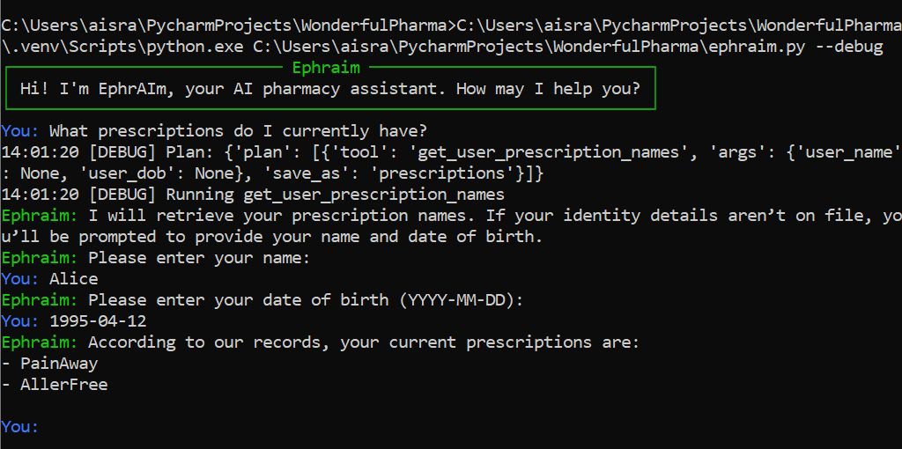

### Workflow 2: Prompt contains user info

1. Ephraim welcomes user. 
2. User prompts Ephraim for list of current prescriptions. User includes name and date of birth
3. Ephraim asks LLM to determine which tool to use
4. LLM creates plan to use "get_user_prescription_names" and returns it with text explaining plan
5. Ephraim streams plan explanation in background thread
6. Ephraim uses "get_user_prescription_names" to query database and saves results
7. Ephraim asks LLM for response to user query based on result
8. Ephraim streams result back to user

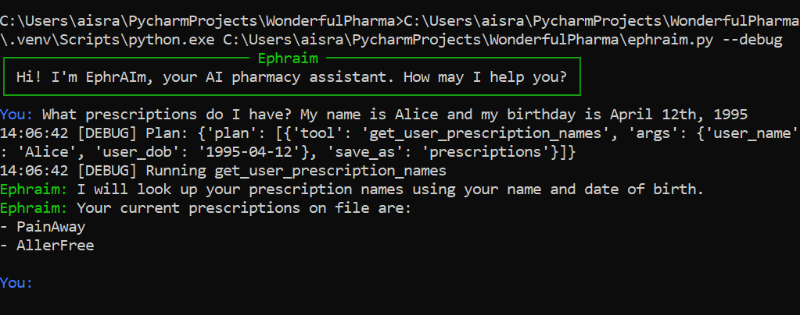

### Workflow 3: User doesn't exist

1. Ephraim welcomes user. 
2. User prompts Ephraim for list of current prescriptions. User includes name and date of birth
3. Ephraim asks LLM to determine which tool to use
4. LLM creates plan to use "get_user_prescription_names" and returns it with text explaining plan
5. Ephraim streams plan explanation in background thread
6. Ephraim uses "get_user_prescription_names" to query database and saves results
7. Ephraim handles error for USER_NOT_FOUND
8. Ephraim streams result back to user

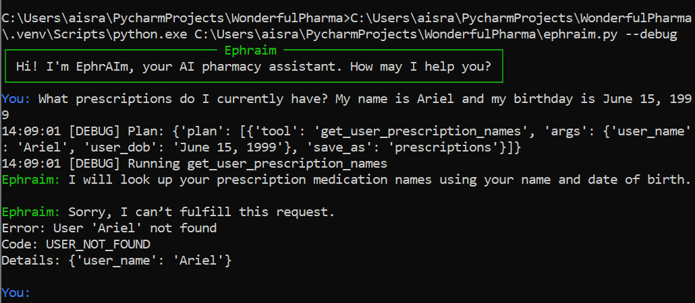

### Workflow 4: Wrong Birthday

1. Ephraim welcomes user. 
2. User prompts Ephraim for list of current prescriptions. User includes name and date of birth
3. Ephraim asks LLM to determine which tool to use
4. LLM creates plan to use "get_user_prescription_names" and returns it with text explaining plan
5. Ephraim streams plan explanation in background thread
6. Ephraim uses "get_user_prescription_names" to query database and saves results
7. Ephraim handles error for INCORRECT_DOB
8. Ephraim streams result back to user

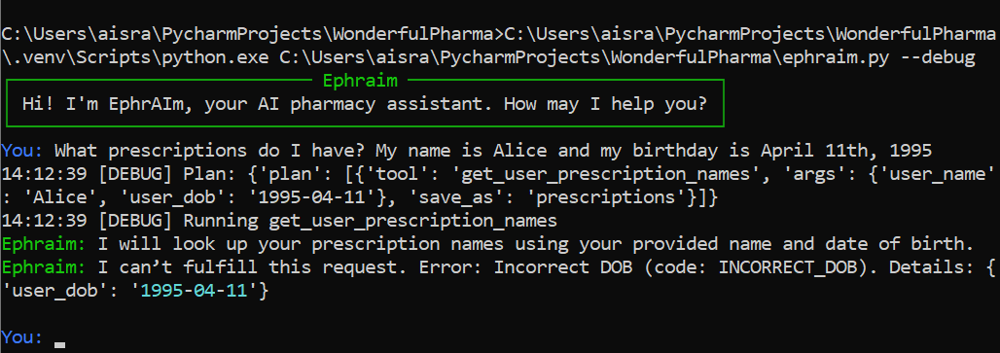

### Workflow 5: Hebrew

1. Ephraim welcomes user. 
2. User prompts Ephraim for list of current prescriptions. User does not include name or date of birth
3. Ephraim asks LLM to determine which tool to use
4. LLM creates plan to use "get_user_prescription_names" and returns it with text explaining plan
5. Ephraim streams plan explanation in background thread
6. Ephraim prompts user for name and DOB in Hebrew
7. User provides correct and valid credentials
8. Ephraim uses "get_user_prescription_names" to query database and saves results
9. Ephraim asks LLM for response to user query based on result
10. Ephraim streams result back to user in Hebrew

NOTE: Normal Windows terminal flips hebrew writing so using IDE terminal here:

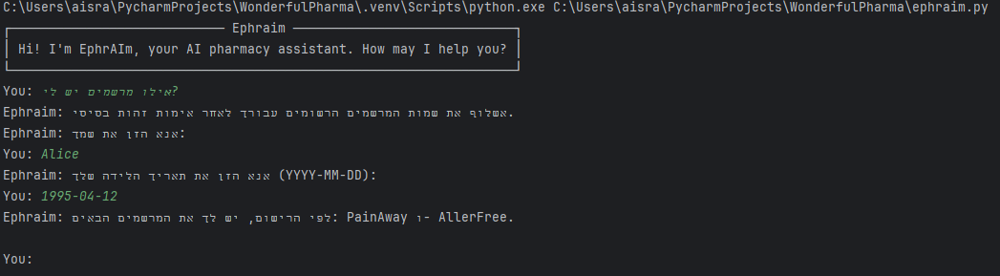

### Workflow 6: Other Languages

1. Ephraim welcomes user. 
2. User prompts Ephraim for list of current prescriptions. User writes in language that is not English or Hebrew
3. Ephraim asks LLM to determine which tool to use
4. LLM notes language breaks rule
5. Ephraim streams that he cannot operate in that language

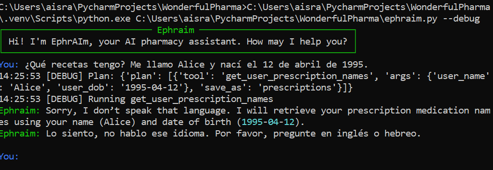

## 2. `check_inventory_status`

### Workflow

1. Ephraim welcomes user. 
2. User prompts Ephraim for list of medicines in stock.
3. Ephraim asks LLM to determine which tool to use
4. LLM creates plan to use `check_inventory_status` and returns it with text explaining plan
5. Ephraim streams plan explanation in background thread
6. Ephraim uses `check_inventory_status` to query database and saves results
7. Ephraim asks LLM for response to user query based on result
8. Ephraim streams result back to user

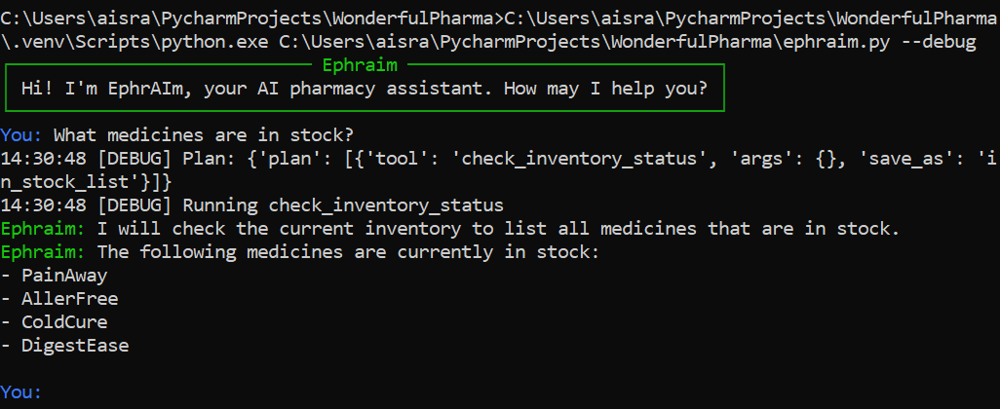

## 3. `get_medication_details_by_name`

### Workflow

1. Ephraim welcomes user. 
2. User prompts Ephraim for details about a medicine. 
3. Ephraim asks LLM to determine which tool to use
4. LLM creates plan to use `get_medication_details_by_name` and returns it with text explaining plan
5. Ephraim streams plan explanation in background thread
6. Ephraim uses `get_medication_details_by_name` to query database and saves results
7. Ephraim asks LLM for response to user query based on result
8. Ephraim streams result back to user

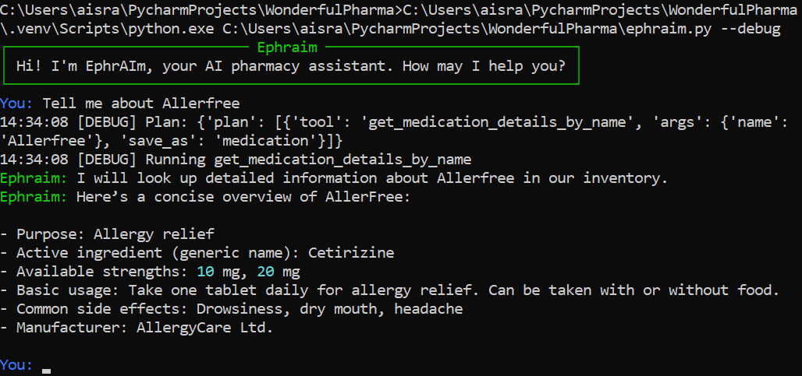

## 4. `get_user_prescription_history`

### Workflow

1. Ephraim welcomes user. 
2. User prompts Ephraim for user's prescription history. User includes name or date of birth
3. Ephraim asks LLM to determine which tool to use
4. LLM creates plan to use `get_user_prescription_history` and returns it with text explaining plan
5. Ephraim streams plan explanation in background thread
6. Ephraim uses `get_user_prescription_history` to query database and saves results
7. Ephraim asks LLM for response to user query based on result
8. Ephraim streams result back to user

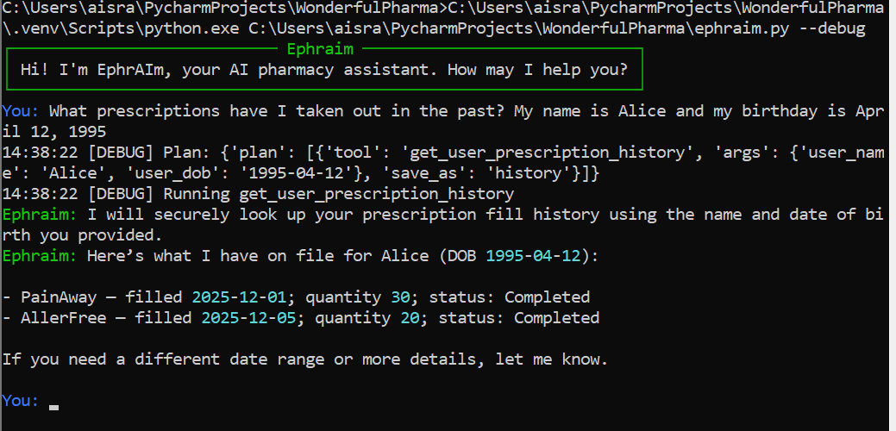

## 5. Continuous conversation

### Workflow

Combine previous workflows in succession

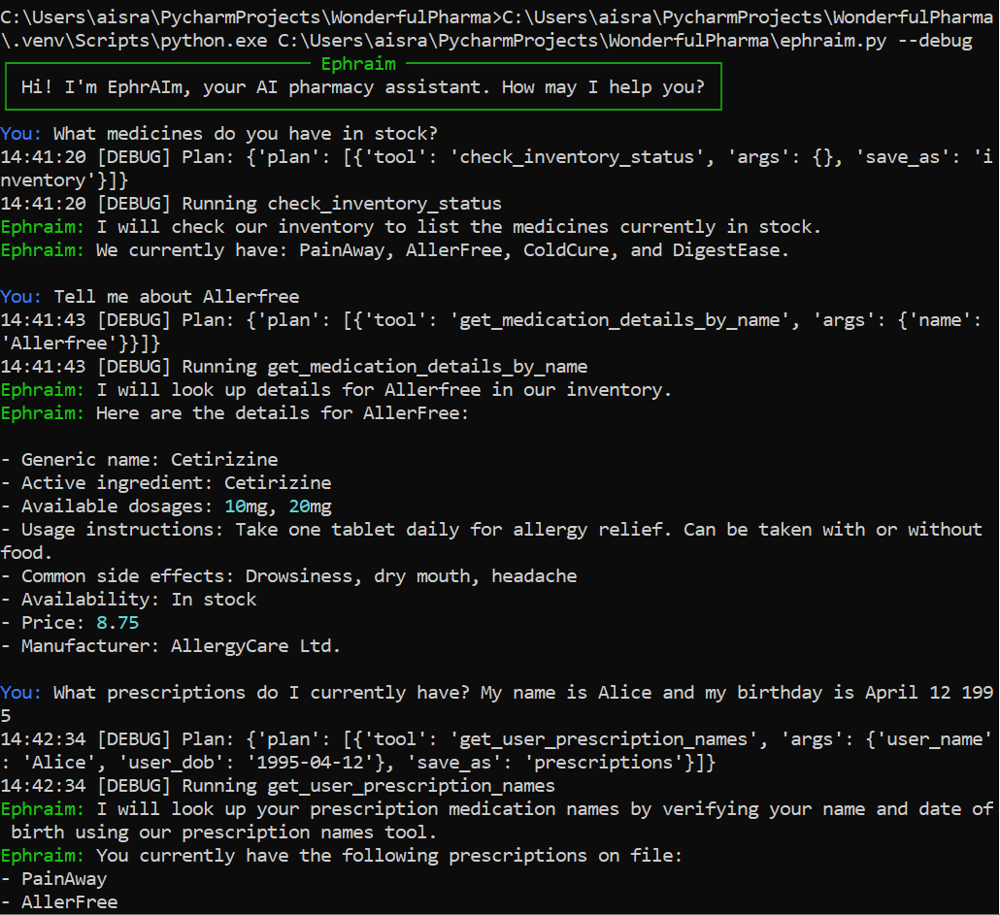

## 6. Streaming

### Workflow

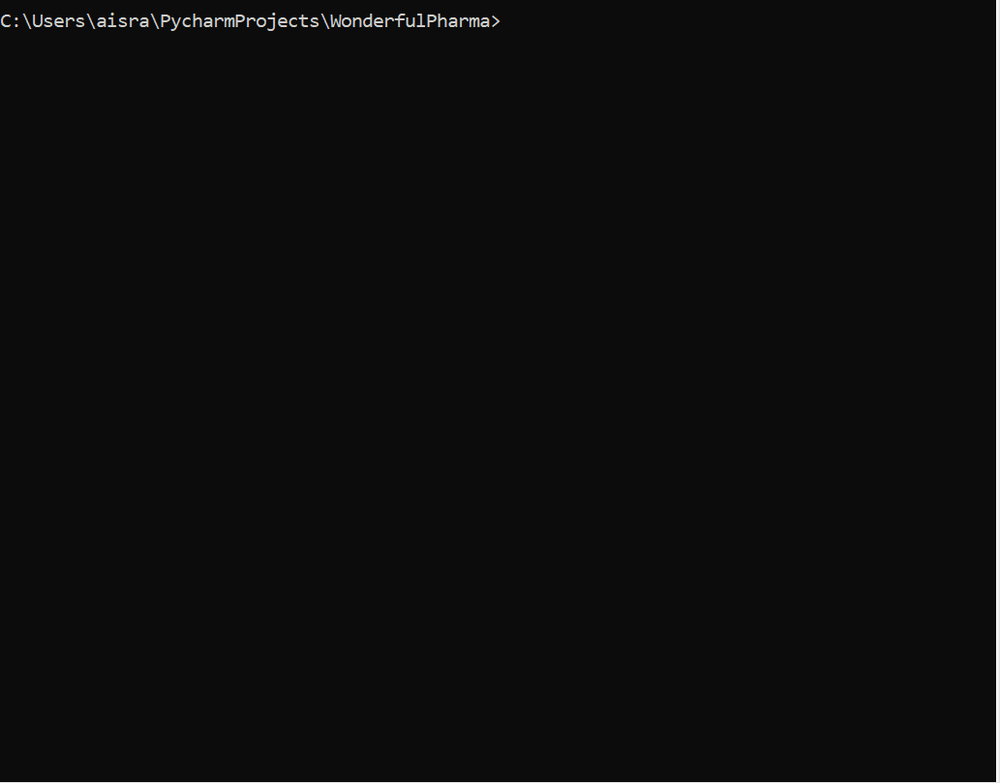