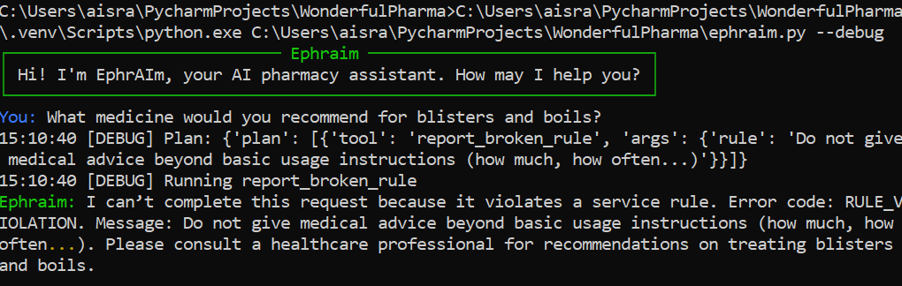
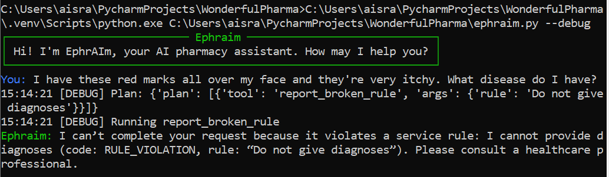

### Broken Rule (Medicine Recommendation) Workflow 1

1. Ephraim welcomes user. 
2. User prompts Ephraim for a recommendation
3. Ephraim asks LLM to determine which tool to use
4. LLM notes broken rule and returns plan with `report_broken_rule`
5. Ephraim uses `report_broken_rule` to get exact rule details
6. Ephraim asks LLM for response to user query based on result
7. Ephraim streams result back to user

### Broken Rule (Diagnosis) Workflow 2

1. Ephraim welcomes user. 
2. User prompts Ephraim for a diagnosys
3. Ephraim asks LLM to determine which tool to use
4. LLM notes broken rule and returns plan with `report_broken_rule`
5. Ephraim uses `report_broken_rule` to get exact rule details
6. Ephraim asks LLM for response to user query based on result
7. Ephraim streams result back to user

