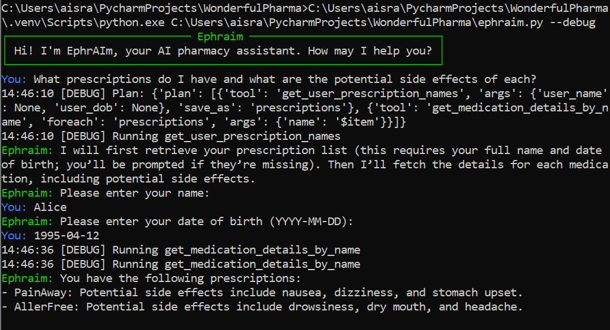
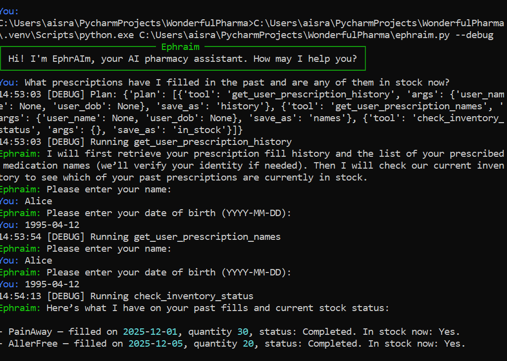

## 1. `What prescriptions do I have and what are the potential side effects of each?`

### Workflow

1. Ephraim welcomes user. 
2. User prompts Ephraim with above prompt. User does not include name or date of birth
3. Ephraim asks LLM to determine which tool to use
4. LLM creates plan to use `get_user_prescription_names` together with `get_medication_details_from_name` and returns it with text explaining plan
5. Ephraim streams plan explanation in background thread
6. Ephraim prompts user for name and DOB
7. User provides correct and valid credentials
8. Ephraim uses `get_user_prescription_names` to query database and saves results
9. Ephraim uses saved results and runs `get_medication_details_from_name` for each one
10. Ephraim asks LLM for response to user query based on execution summary
11. Ephraim streams result back to user

## 2.  What prescriptions have I filled in the past and are any of them in stock now?
### Workflow

1. Ephraim welcomes user. 
2. User prompts Ephraim with above prompt. User does not include name or date of birth
3. Ephraim asks LLM to determine which tool to use
4. LLM creates plan to use `get_user_prescription_history` together with `check_inventory_status` and returns it with text explaining plan
5. Ephraim streams plan explanation in background thread
6. Ephraim prompts user for name and DOB
7. User provides correct and valid credentials
8. Ephraim uses `get_user_prescription_history` to query database and saves results
9. Ephraim uses saved results and runs `check_inventory_status` to search for results
10. Ephraim asks LLM for response to user query based on execution summary
11. Ephraim streams result back to user

